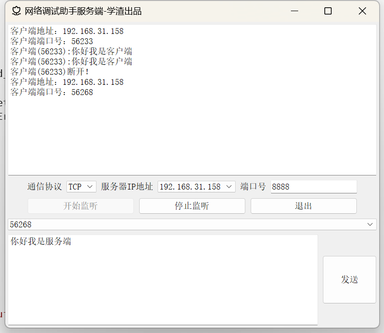
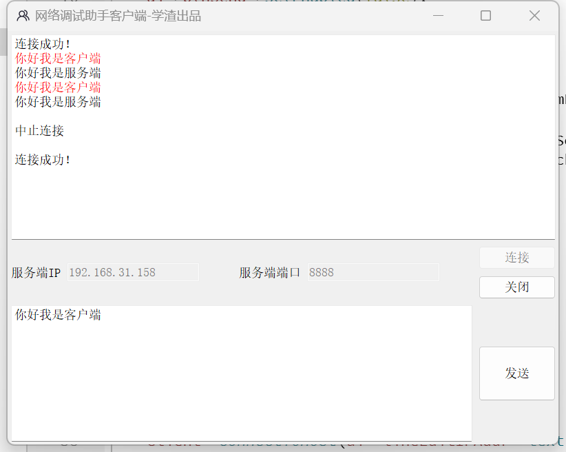

# TCP网络调试助手

## 项目介绍
一个基于Qt框架开发的TCP网络通信调试工具，支持服务器端和客户端双向通信测试。

## 项目背景
在网络应用开发和调试过程中，经常需要测试TCP通信功能是否正常工作。本项目旨在提供一个简单易用的工具，帮助开发人员快速验证网络通信功能，定位和解决网络通信问题，提高开发效率。

## 技术栈

### 开发框架（开发环境）
- Qt 5.15.2：跨平台C++图形用户界面应用程序开发框架
- MinGW 32位编译器：用于编译Qt应用程序
- Qt Creator：集成开发环境

### 核心版块（项目重要组成部分）
- TcpServer：服务器端模块，负责监听连接、管理客户端会话、收发数据
- TcpClient：客户端模块，负责建立连接、发送数据、接收数据
- MyComboBox：自定义组合框组件，用于服务器端管理客户端列表

### 技术支持（相关技术栈）
- C++：主要开发语言
- Qt网络模块（QTcpServer、QTcpSocket）：实现TCP网络通信功能
- Qt信号与槽机制：实现组件间通信
- Qt界面设计（QWidget、QTextEdit、QComboBox等）：构建用户交互界面

## 项目功能

### 服务器端功能
1. **监听设置**：支持选择本机IP地址和设置监听端口
2. **客户端管理**：显示已连接客户端信息，支持刷新客户端列表
3. **消息收发**：接收客户端消息并显示，支持向特定客户端或所有客户端发送消息
4. **连接状态管理**：显示客户端连接和断开状态

### 客户端功能
1. **服务器连接**：支持输入服务器IP地址和端口号进行连接
2. **消息收发**：支持向服务器发送消息并接收服务器返回的消息
3. **连接状态管理**：显示连接成功、断开、错误等状态信息
4. **超时检测**：连接超时自动取消并提示
5. **消息颜色区分**：发送和接收的消息以不同颜色显示，便于区分

## 项目应用方向

### 未来应用趋势
- **多协议支持**：扩展UDP、HTTP、WebSocket等多种网络协议的调试能力，成为全功能网络调试平台
- **智能化分析**：引入数据格式自动识别与解析功能（如JSON、XML、二进制数据等），提供可视化数据展示
- **跨平台兼容**：完善对Windows、macOS、Linux等主流操作系统的支持，满足不同开发环境需求
- **云端集成**：开发云服务功能，支持远程调试和历史记录存储，实现跨设备调试协作
- **自动化测试**：增加脚本录制与回放功能，支持自动化网络通信测试流程

### 行业应用方向
- **物联网开发**：为IoT设备网络通信测试提供简便工具，支持低功耗设备通信调试
- **嵌入式系统**：针对嵌入式设备的网络功能开发与测试，支持串口转网口调试
- **移动应用开发**：辅助移动应用开发者测试与服务器端的通信协议和数据交互
- **网络设备测试**：用于路由器、交换机等网络设备的通信功能验证和故障排查
- **教育与培训**：作为网络通信原理教学的实践工具，帮助学生直观理解TCP/IP协议族

## 使用说明

### 服务器端操作流程
1. 运行TcpServer应用程序
2. 在"服务器IP地址"下拉框中选择要监听的本机IP
3. 在"端口号"输入框中输入要监听的端口号
4. 点击"开始监听"按钮
5. 等待客户端连接，连接成功后会显示客户端信息
6. 在消息输入框中输入要发送的消息
7. 在客户端列表中选择要发送的目标客户端（可选择"all"发送给所有客户端）
8. 点击"发送"按钮发送消息
9. 接收到的消息会显示在接收文本框中
10. 点击"停止监听"按钮结束服务

### 客户端操作流程
1. 运行TcpClient应用程序
2. 在"服务端IP"输入框中输入服务器的IP地址
3. 在"服务端端口"输入框中输入服务器的端口号
4. 点击"连接"按钮尝试连接服务器
5. 连接成功后，可以在消息输入框中输入消息
6. 点击"发送"按钮发送消息给服务器
7. 接收到的消息会显示在接收文本框中
8. 点击"断开连接"按钮结束会话

## 编写项目时遇到的问题及解决方法

### 问题一：为什么每次客户端断开后重新连接时，连接成功的信息词会随着重新连接的次数增多累加显示在客户端接收框当中？
**答**:信号与槽的“重复绑定”造成的，因为每当我新连接时，以前旧的信号槽跟着一起绑定上了，第一次连接时绑定 1 次，断开后第二次连接又绑定 1 次，此时socket的connected()信号会触发 2 次提示；第三次连接绑定 3 次，触发 3 次提示，以此类推。所以每次新绑定前接触就绑定即可，使用disconnect解除之前空的信号槽。

### 问题二：为什么服务端的ConnectedState和ConnectingState状态没有显示预期效果？
**答**:一方面服务端的ConnectedState和ConnectingState状态是在服务端程序中实现的。服务端程序中只有在客户端成功连接上后，才会触发connected()信号，才会改变ConnectedState状态为true。所以服务端的ConnectedState和ConnectingState状态只有在客户端成功连接上后才会改变。另一方面ConnectedState和ConnectingState共用同一个处理分支，ConnectingState是一个过渡状态，从调用connectToHost()到连接成功的时间非常短，可能在你看到界面输出前就已经切换到ConnectedState或UnconnectedState了，所以很难捕捉到这个状态的输出。

### 注意：运行前必须先关梯子（VPN），否则会导致连接失败！！！！！

